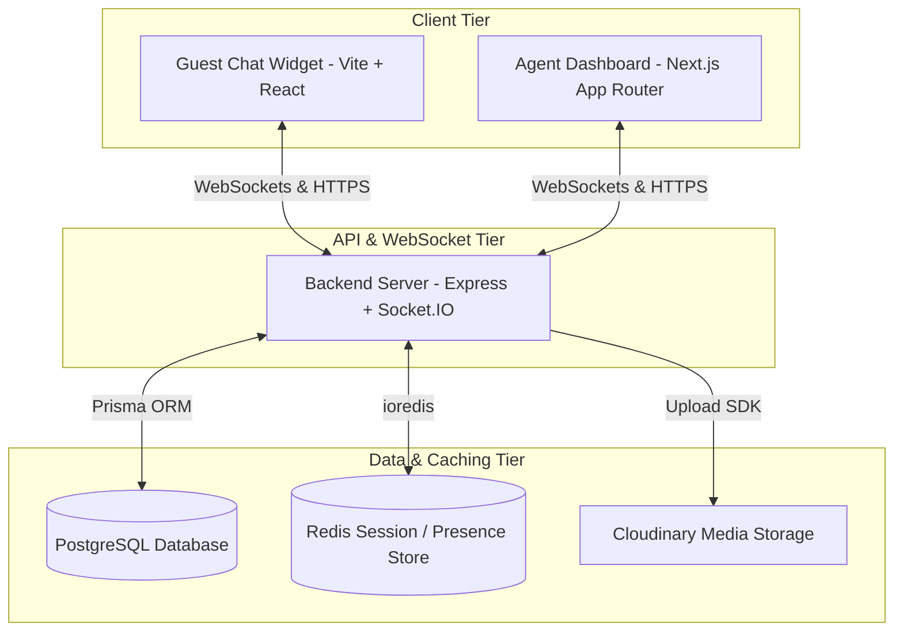

# Enterprise Live Support System (ELS)

[](https://www.typescriptlang.org/)
[](https://nextjs.org/)
[](https://react.dev/)
[](https://expressjs.com/)
[](https://www.postgresql.org/)
[](https://redis.io/)

ELS is a multi-tenant, real-time live support chat platform and shared team inbox designed to simulate enterprise-scale customer service workflows. It bridges the gap between anonymous end-users requesting real-time assistance (via a lightweight chat widget) and internal agent teams managing incoming tickets (via a rich dashboard).

---

## System Architecture

Instead of relying on standard HTTP polling loops, ELS leverages a high-throughput, bidirectional event matrix. The monorepo separates concerns into two decoupled frontends and a stateless, scale-ready backend service:



For a deeper dive into architecture and schemas, refer to the [AI_CONTEXT.md](file:///home/bhargab/WebD/live-support-system/AI_CONTEXT.md) guide.

---

## Core Highlights & Workflows

- **Persistent Guest Sessions**: A floating React customer widget utilizes cryptographic tracking tokens stored in `localStorage`. If a customer closes their tab, drops their connection, or refreshes the page, their full historical conversation state is securely hydrated upon reconnection.
- **Dynamic Shared Inbox (The Queue)**: An enterprise-style ticket routing dashboard for support agents. Conversations transition in real-time across isolated structural queues: `Unassigned` ➔ `Mine` (Assigned to Me) ➔ `Closed`.
- **Atomic Ticket Claiming**: Claims are handled atomically. The system moves the agent into the customer's dedicated WebSocket room, updates PostgreSQL, and emits a broadcast event to instantly purge that conversation from all other active agents' unassigned columns.
- **Cloudinary File Attachments**: Supports sending images, PDFs, or files in the chat thread. The files are securely uploaded via a multipart Multer pipeline to Cloudinary and stored as relational `Attachment` records in PostgreSQL.
- **Redis-Backed Resiliency**: Node.js application instances are designed to be completely stateless. Active socket connections, agent online/offline statuses, and typing indicators are cached in Redis with a strict Time-to-Live (TTL), enabling clean horizontal scaling.

---

## Repository Layout

The workspace is organized as a multi-package repository (each service operates with its own `package.json` and dedicated documentation):

```
live-support-system/
├── docs/                      # Original design & protocol specs
├── server/                    # Express + Socket.io + Prisma Server (See server/README.md)
│   ├── prisma/                # Database migrations and PostgreSQL schema
│   └── src/                   # Backend Server source code
├── widget/                    # Vite + React Guest Chat Widget (See widget/README.md)
│   └── src/                   # Chat widget UI and store
└── agent-dashboard/           # Next.js Agent Admin dashboard (See agent-dashboard/README.md)
    ├── app/                   # App Router pages and layouts
    ├── components/            # Reusable UI dashboard panels
    └── hooks/                 # Custom React hooks (use-dashboard-socket.ts)
```

- 🖥️ **Backend Server Guide**: [server/README.md](file:///home/bhargab/WebD/live-support-system/server/README.md)
- 💬 **Guest Widget Guide**: [widget/README.md](file:///home/bhargab/WebD/live-support-system/widget/README.md)
- 📊 **Agent Dashboard Guide**: [agent-dashboard/README.md](file:///home/bhargab/WebD/live-support-system/agent-dashboard/README.md)

---

## Environment Configuration

Copy the sample environment files in each directory:

### Backend Server (`server/.env`)
| Variable | Default / Description |
| :--- | :--- |
| `PORT` | `8000` (Server Port) |
| `DATABASE_URL` | PostgreSQL connection URL (e.g., `postgresql://...`) |
| `ACCESS_TOKEN_SECRET` | Cryptographic secret for signing JWT access tokens |
| `ACCESS_TOKEN_EXPIRY` | `1d` (Expiry duration for JWT access tokens) |
| `REFRESH_TOKEN_SECRET` | Cryptographic secret for signing JWT refresh tokens |
| `REFRESH_TOKEN_EXPIRY` | `15d` (Expiry duration for JWT refresh tokens) |
| `REDIS_URL` | `redis://localhost:6379` (Redis Connection URI) |
| `CLOUDINARY_CLOUD_NAME` | Cloudinary storage account cloud name |
| `CLOUDINARY_API_KEY` | Cloudinary storage API Key |
| `CLOUDINARY_API_SECRET` | Cloudinary storage API Secret |

### Agent Dashboard (`agent-dashboard/.env`)
| Variable | Default / Description |
| :--- | :--- |
| `API_BASE_URL` | `http://127.0.0.1:8000/api/v1` (Proxies server-side Next.js `/api/*` endpoints to the server) |
| `NEXT_PUBLIC_API_BASE_URL` | `http://localhost:3000/api` (Points client axios instances to the Next.js proxy route) |

### Guest Widget (`widget/.env`)
| Variable | Default / Description |
| :--- | :--- |
| `VITE_API_BASE_URL` | `http://127.0.0.1:8000/api/v1` (Direct API endpoint address for the backend REST routes) |

---

## 2. Quick Start Guide

Follow these steps to set up and run the application locally:

### 0. Prerequisites
- **Node.js** (v18+ recommended)
- **PostgreSQL** database server
- **Redis** server

### 1. Database & Cache Services (Local Docker Setup)
A `docker-compose.yml` file is provided inside the `server/` directory to spin up a local Redis instance:
```bash
cd server
docker compose up -d
```

### 2. Database Migrations
Configure your PostgreSQL `DATABASE_URL` in `server/.env` and execute migrations:
```bash
cd server
npx prisma generate
npx prisma db push   # Or use migrations: npx prisma migrate dev
```

### 3. Install & Start Development Servers

Run the backend server, the client widget, and the agent dashboard concurrently:

#### Backend Server
```bash
cd server
npm install
npm run dev
# Server will run on http://localhost:8000
```

#### Client Widget
```bash
cd widget
npm install
npm run dev
# Widget will run on http://localhost:5173
```

#### Agent Dashboard
```bash
cd agent-dashboard
npm install
npm run dev
# Dashboard will run on http://localhost:3000
```

---

## Technical Documentation & Specs

For deep technical details, event registries, and layout maps, refer to the documents in the [docs](file:///home/bhargab/WebD/live-support-system/docs) directory:
- [AI_CONTEXT.md](file:///home/bhargab/WebD/live-support-system/AI_CONTEXT.md) — The master guide on architecture, Redis key factory structures, and endpoints.
- [Socket Event Specifications](file:///home/bhargab/WebD/live-support-system/docs/socket-events.md) — Details on message formatting, namespaces, and typing payloads.
- [Database Schema Design](file:///home/bhargab/WebD/live-support-system/docs/db-design.md) — Indexing structures, cascade constraints, and ER designs.
- [Project Feature Matrix](file:///home/bhargab/WebD/live-support-system/docs/project-status.md) — Full feature map showing implementation status.
