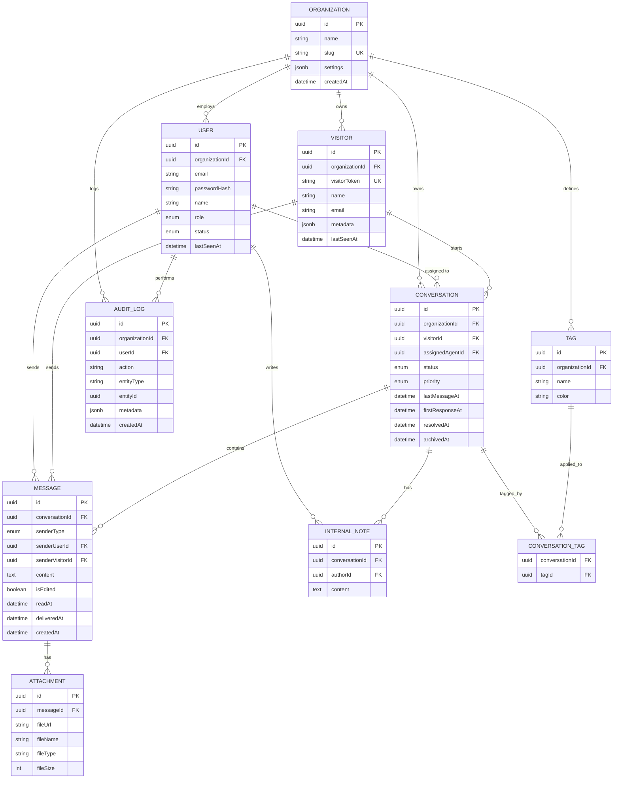

# ELS DB Design

PostgreSQL + Prisma. Multi-tenant via `organizationId` on every tenant-owned row (row-level tenancy, not schema-per-tenant — simplest to reason about and to index).

---

## 1. ER Diagram

---

## 2. Design Decisions

### 2.1 Multi-tenancy

Every tenant-scoped table carries `organizationId` directly (not derived through joins), even where it's technically reachable through a relation (e.g. `Message.organizationId` isn't stored — it's reached via `Conversation`, but `Tag`, `AuditLog`, `Visitor`, `User`, `Conversation` all store it directly). This keeps every tenant-boundary query a single indexed WHERE clause instead of a join, which matters a lot once you add a Prisma middleware or RLS policy that auto-injects `organizationId` on every query — the standard way to guarantee tenant isolation at the data layer.

### 2.2 Polymorphic sender on `Message`

A message can come from a visitor, an agent, or the system (e.g. "Conversation claimed by Alex"). Rather than a single polymorphic `senderId` (which Prisma/Postgres can't foreign-key cleanly), `Message` has two nullable FKs — `senderUserId` and `senderVisitorId` — plus a `senderType` enum that tells you which one is populated. A DB-level `CHECK` constraint (added via raw SQL migration, since Prisma doesn't express this natively) enforces exactly one is set when `senderType != SYSTEM`.

### 2.3 Conversation lifecycle as an enum, not a state machine table

`ConversationStatus` (`NEW → UNASSIGNED → CLAIMED → ACTIVE → RESOLVED → ARCHIVED`) is a plain enum column. A separate `ConversationStatusHistory` table is a natural v2 addition if you need to chart time-in-status per stage — for the MVP, `AuditLog` already captures every transition, so it's not duplicated.

### 2.4 Tags are many-to-many via an explicit join table

`ConversationTag` is modeled explicitly (not Prisma's implicit m2m) so it can carry `createdAt` and later `taggedByUserId` without a migration.

### 2.5 Attachments belong to messages, not conversations

Keeps "list all files shared in this conversation" a single join, and mirrors how the widget/dashboard will actually render them (inline, under a specific message).

### 2.6 Soft lifecycle timestamps instead of a boolean-per-state

`firstResponseAt`, `resolvedAt`, `archivedAt` are nullable timestamps directly on `Conversation`. This is what powers the Phase 10 analytics (first response time, resolution time) without a separate events table — cheap to query, cheap to index.

---

## 3. Indexing Strategy

| Table          | Index                                  | Reason                                                 |
| -------------- | -------------------------------------- | ------------------------------------------------------ |
| `User`         | `(organizationId, email)` unique       | Login lookup, per-tenant email uniqueness (not global) |
| `User`         | `organizationId`                       | Agent list per org                                     |
| `Visitor`      | `visitorToken` unique                  | Widget reconnect — the hottest visitor-side lookup     |
| `Visitor`      | `organizationId`                       | Visitor list/search                                    |
| `Conversation` | `(organizationId, status)`             | Dashboard inbox filters ("show me unassigned")         |
| `Conversation` | `assignedAgentId`                      | "My conversations" view                                |
| `Conversation` | `(organizationId, lastMessageAt DESC)` | Default inbox sort                                     |
| `Message`      | `(conversationId, createdAt)`          | Cursor-paginated message thread                        |
| `Tag`          | `(organizationId, name)` unique        | Prevent duplicate tag names per org                    |
| `AuditLog`     | `(organizationId, createdAt DESC)`     | Audit log timeline                                     |
| `AuditLog`     | `(entityType, entityId)`               | "History for this specific conversation/user"          |

All PKs are `uuid` (via `gen_random_uuid()` / Prisma `cuid()`—see schema for the chosen default) rather than serial ints, since IDs are exposed to the client (visitor tokens, conversation IDs in URLs) and shouldn't leak row counts or be guessable.

---

## 4. Cascade Rules

- `Organization` delete → cascades to everything (org offboarding wipes its data)
- `Conversation` delete → cascades to `Message`, `InternalNote`, `ConversationTag`, and `Attachment` (via `Message`)
- `User` delete → **restrict**, not cascade. Agents shouldn't be hard-deleted while they have assigned conversations or authored messages/notes — deactivate via `status`/a `deletedAt` field instead, and reassign `assignedAgentId` to null on removal.
- `Visitor` delete → restrict (needed for conversation history integrity); visitors are anonymized, not deleted, if you need GDPR-style erasure.

---

## 5. What's deliberately left out of the MVP schema

- `ConversationStatusHistory` — derivable from `AuditLog` for now
- `Team`/`Department` grouping of agents — round-robin assignment logic in Phase 7/9 can start with a flat agent list
- `CannedResponse` — stretch goal (v2), add when you get there
- Full-text search index (Postgres `tsvector` on `Message.content`) — add once search (Phase 5 "Search" feature) is actually implemented, not before

These are the natural v2 extension points once the MVP round-trips.
