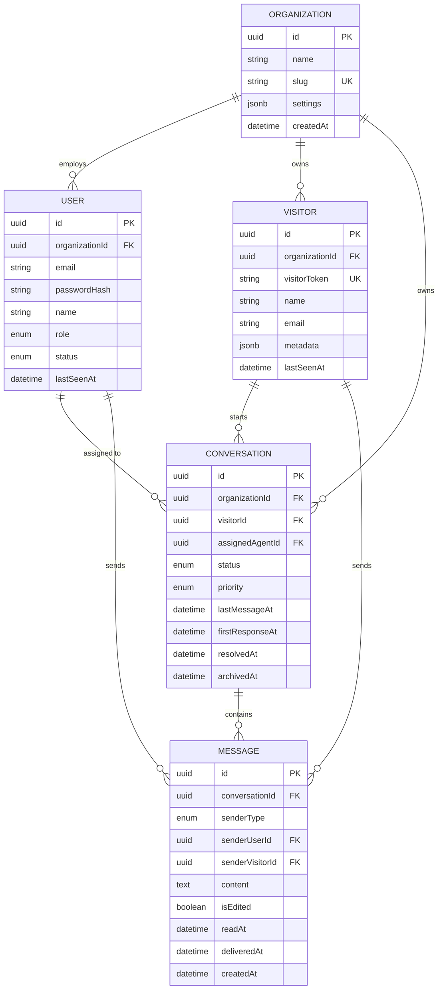

```mermaid
erDiagram
    ORGANIZATION ||--o{ USER : employs
    ORGANIZATION ||--o{ VISITOR : owns
    ORGANIZATION ||--o{ CONVERSATION : owns
    %% ORGANIZATION ||--o{ TAG : defines
    %% ORGANIZATION ||--o{ AUDIT_LOG : logs

    USER ||--o{ CONVERSATION : "assigned to"
    USER ||--o{ MESSAGE : sends
    %% USER ||--o{ INTERNAL_NOTE : writes
    %% USER ||--o{ AUDIT_LOG : performs

    VISITOR ||--o{ CONVERSATION : starts
    VISITOR ||--o{ MESSAGE : sends

    CONVERSATION ||--o{ MESSAGE : contains
    %% CONVERSATION ||--o{ INTERNAL_NOTE : has
    %% CONVERSATION ||--o{ CONVERSATION_TAG : tagged_by
    %% TAG ||--o{ CONVERSATION_TAG : applied_to

    %% MESSAGE ||--o{ ATTACHMENT : has

    ORGANIZATION {
        uuid id PK
        string name
        string slug UK
        jsonb settings
        datetime createdAt
    }
    USER {
        uuid id PK
        uuid organizationId FK
        string email
        string passwordHash
        string name
        enum role
        enum status
        datetime lastSeenAt
    }
    VISITOR {
        uuid id PK
        uuid organizationId FK
        string visitorToken UK
        string name
        string email
        jsonb metadata
        datetime lastSeenAt
    }
    CONVERSATION {
        uuid id PK
        uuid organizationId FK
        uuid visitorId FK
        uuid assignedAgentId FK
        enum status
        enum priority
        datetime lastMessageAt
        datetime firstResponseAt
        datetime resolvedAt
        datetime archivedAt
    }
    MESSAGE {
        uuid id PK
        uuid conversationId FK
        enum senderType
        uuid senderUserId FK
        uuid senderVisitorId FK
        text content
        boolean isEdited
        datetime readAt
        datetime deliveredAt
        datetime createdAt
    }
```
