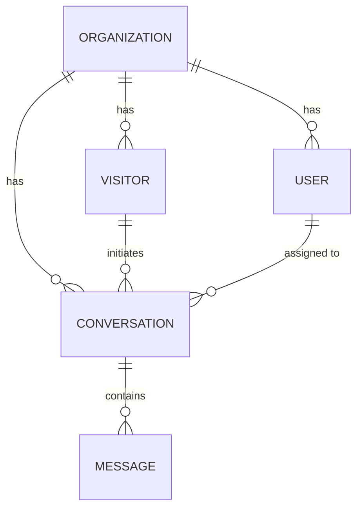

# API Structure

This document describes the architectural patterns, route layouts, standard response schemas, error structures, database models, and socket communication layout utilized by the Live Support System Server.

---

## 1. Directory Structure

The server is written in TypeScript and follows a controller-router-middleware architectural pattern:
- `src/index.ts`: Main server entry point (configures httpServer and socket.io server).
- `src/app.ts`: Configures Express middleware, routes, and global error handlers.
- `src/routes/`: Defines the routing mapping.
- `src/controllers/`: Implements the core request handling logic.
- `src/socket/`: Defines WebSocket events and socket authentication.
- `src/middleware/`: Houses token authentication, error formatting, and validation middlewares.

---

## 2. Response & Error Handling Architecture

The API uses standardized wrappers to construct predictable HTTP responses.

### 2.1 Standard API Response
Every successful API request returns a JSON response instantiated from `ApiResponse`:

```json
{
  "statusCode": 200,
  "message": "Operation completed successfully",
  "data": { ... }
}
```

Implementation Example:
```typescript
return res.status(200).json(
  new ApiResponse({
    statusCode: 200,
    message: "Login successful",
    data: userData
  })
);
```

### 2.2 Standard API Errors
All errors, including validation errors and server crashes, are formatted uniformly.
Thrown exceptions should be instances of `ApiError`:

```typescript
// Simple Error
throw new ApiError({
  statusCode: 404,
  message: "Conversation not found",
  error: "Not Found",
});

// Validation/Detailed Errors
throw new ApiError({
  statusCode: 400,
  message: "Validation failed",
  error: "Bad Request",
  errors: ["Password must be at least 6 characters long"]
});
```

The global `errorHandler.ts` catches these instances and normalizes them for the API response.

---

## 3. Database Schema Models

We utilize Prisma ORM with PostgreSQL. The core entities are:

1. **Organization**: Represents the business customer (e.g., "Acme Corp").
2. **User**: Represents registered agents and admins belonging to an organization.
3. **Visitor**: Anonymous web visitors requesting live chat. Identified by a unique token.
4. **Conversation**: Active support chat sessions linking a Visitor to an optional assigned User (Agent) under an Organization.
5. **Message**: Individual messages within a Conversation, tagged with a `senderType` (`AGENT` or `VISITOR`).



---

## 4. WebSocket (Socket.io) Architecture

Realtime chat functionality is implemented using Socket.io.

### 4.1 Authentication Middleware
Connections undergo socket-level handshake authentication `src/socket/authenticateSocket.ts`:
- **Agents** pass an `accessToken` in socket auth. This payload verifies their active user status and attaches `type: 'agent'`, `userId`, and `organizationId` to the socket data.
- **Visitors** pass their `visitorToken`. This checks their valid database visitor registration and attaches `type: 'visitor'`, `visitorId`, and `organizationId` to the socket data.

### 4.2 Messaging Rooms
Sockets join rooms grouped by `conversationId`. Sending a message saves it to the database using Prisma and broadcasts the message payload to all listening clients inside the room.